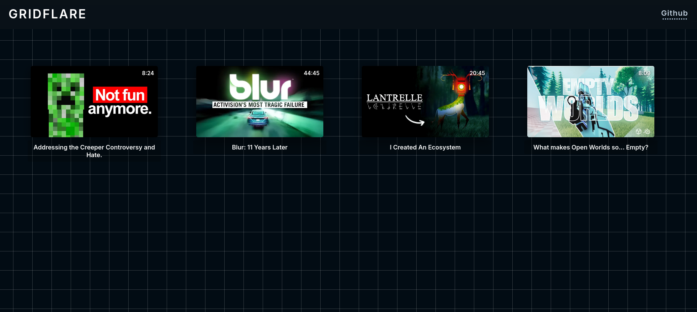

# GridFlare v0.1

A simple, homelab video streaming service with current integration for youtube. Just a fun little project I threw together, becuase I wanted to learn how to intergrate FTP's, .m4s, and a video player on the web. It uses [Plyr.js](https://github.com/sampotts/plyr) for the video player, and there’s not much else to it.



---

### Installation

> [!IMPORTANT]
> Windows support is untested at best.

Pre-requisties: `Python 3.9+`, `yt-dlp`, `ffmpeg`

1. Clone this repo:
```bash
git clone https://github.com/solarbyte-dev/gridflare
```
2. Get the videos:
```bash
python lazydown.py
Enter video URL: {URL}
Enter name: {NAME}
```
3. Run the server:
```bash
python main.py
```
> [!NOTE]
> If you plan to use any other downloading service/want to sync already downloaded videos, then go over to video.json and fill the details correctly for each video, a future update will address this

---

### Features

* Grid layout for displaying video thumbnails.
* Clicking a thumbnail opens a video player in fullscreen.
* Video player is fully customizable (play, pause, volume, fullscreen, etc.).
* Responsive; it’ll scale to any screen size (more or less).
* Simple, almost *too* minimalistic interface.

---

### How It Works

It’s really simple. I used the [Plyr.js](https://github.com/sampotts/plyr) library for the video player. `script.js` reads video.json and fetches the correct image and thumbnail, which is then showed on the website. It's REALLY barebones (for now)

#### video.json
`video.json` is the file used for thumbnail, and actual video location, along with the id and length (in seconds). And exmaple is:

```json
[
    {
        "id": "50axoidZwE0",
        "title": "Addressing the Creeper Controversy and Hate.",
        "length": 504.151655,
        "thumbnail": "thumbnails/creeper-controversy.webp"
    },
    {
        "id": "uwJPHUkft0A",
        "title": "Blur: 11 Years Later",
        "length": 2685.666395,
        "thumbnail": "thumbnails/blur-activision.webp"
    },
    {
        "id": "xM2pHUelP-0",
        "title": "I Created An Ecosystem",
        "length": 1245.843447,
        "thumbnail": "thumbnails/i-created-a-ecosystem.webp"
    },
    {
        "id": "yUNhVpsWdXM",
        "title": "What makes Open Worlds so... Empty?",
        "length": 489.917823,
        "thumbnail": "thumbnails/what-makes-open-world-so-empty.webp"
    }
]
```

> [!NOTE]
> The length field is in seconds, and the script.js currently only supports videos less than 1hr long

---

### TODOs (Maybe Later)

* More options (like sorting stuff, tags etc)
* An  updating script; auto-generating thumbnails
* Add keyboard shortcuts for video controls (because I like mpv too much)
* Add an actual TUI using textual

---

### License
Licensed under the MIT license